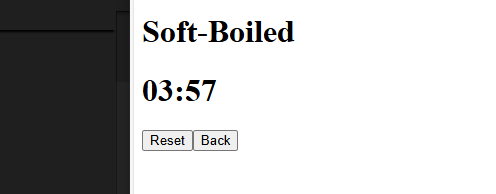
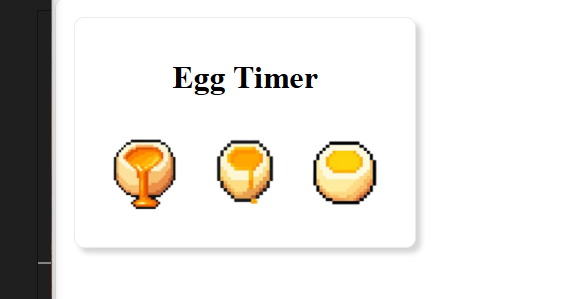

#  Building an Egg Timer App  
**Project Start Date:** 18.06.2025  
**Total Time So Far:** ~14 hours  

A retro pixel-art inspired egg timer built with React.js — my first solo project exploring components, sound, and interactivity.

---

##  Development Timeline

### **18.06.2025 – The Beginning**
I’ve always wanted to build a dedicated egg timer. This marks my first solo build using:

- React (as my first front-end framework)
- JavaScript
- HTML & CSS

I started by sketching out some core feature ideas. _(Still a work in progress!)_

 

Next step: building the skeleton layout.

Started working on the main page layout.

This initial phase took about 15–20 minutes — still warming up to React!

---

### **20.06.2025 – A Setback**
Realized I forgot to create `pages/` and `components/` folders. Also missed installing `react-router-dom`.

Had to restructure and refactor everything — took 2 hours to get back on track and adjust to React’s flow.

---

### **23.06.2025 – Routing Logic**
Added paths to separate timers for different egg types (4, 6, 12 minutes).

 

Home page is now functional and styled.

Created padding logic to display a leading zero for seconds under 10 (e.g., `09`).

Built a start/reset mechanism for the soft-boiled egg page.

 

 

 

Skeleton complete!  
Total time for this phase: 5 hours.

---

### **24.06.2025 – CSS Styling**
Began with external styling for the home page.

Decided to visually differentiate timers by adding AI-generated egg images. Had to ensure all images shared a transparent background for consistency.

 

 

 

This image refinement took roughly 3 hours to get right.

---

### **25.06.2025 – Pixel Aesthetic & Interaction**
Styling complete! 

**Design choice:** Retro pixel-gaming UI — warm, nostalgic, and appealing to all age groups.

Bonus features added:
-  **Image hover effect** — expands on hover for better UX.
-  **Timer pulse animation** — the egg pulses while cooking.
-  **Subtle glow** — to show countdown is active.

Styling phase time: ~3 hours.  
**Total work so far:** ~13 hours.

---

###  Final Touch – Audio Feedback

Implemented `ding.mp3`, which plays **three times** when the timer hits zero.

 _Future ideas:_
- Crack animation as timer ends 🥚➡️🐣  
- Pulse slows down toward countdown finish

---

##  Summary

The egg timer project now has:
- Multi-page routing
- State-driven countdown logic
- Image/audio feedback
- Retro-style UI with animation

All built from scratch using **React**.

---

 _Still to come:_ additional polish and maybe some post-timer effects.  
This was a huge learning experience — and I’m proud of how far it’s come!